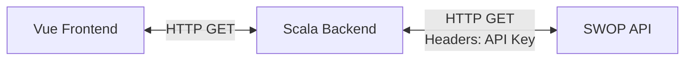

# Currency Converter

## About

This project is a straightforward currency converter web application. Enter the source currency, target currency, and amount to perform the conversion. It uses the [SWOP API](https://swop.cx/), requiring an API key to operate.



## Essentials

Prerequisites:

- Docker
- Sbt 1.10.7 or higher

### Configure the application

Make `.env` file in the root

```
touch .env
```

Add the following environment variables to the `.env` file:

```
SWOP_API_KEY=your_api_key_here
SWOP_HOST=https://swop.cx/rest
```

### Build frontend

```
docker compose build
```

### Build backend

```
cd backend && sbt docker:publishLocal && cd ..
```

### Run the whole application

```
docker compose up
```

Access the frontend at http://localhost:3000/

Swagger docs for the API are found at http://localhost:8080/docs/
